# SSDLite Pipeline — PLS vs PCA/OLS Flow Diagram

```mermaid
flowchart TD
    %% ── 1. INPUT ───────────────────────────────────────
    subgraph INPUT["1. Input"]
        direction LR
        texts["Texts\n(list[str])"]
        y["Outcome y\n(numeric array)"]
        emb["Embeddings\n(.ssdembed/.kv/.bin/.txt)"]
        lex["Lexicon\n(seed words)"]
    end

    %% ── 2. PREPROCESSING ──────────────────────────────
    subgraph PREPROCESS["2. Preprocessing"]
        direction LR
        load_emb["Embeddings.load()\nL2 normalize\noptional ABTT denoising"]
        corpus["Corpus(texts, lang)\nspaCy tokenize\n→ lemmatize\n→ remove stopwords"]
        filter["Filter NaN/Inf\nalign docs ↔ y\npass lexicon through"]
    end

    texts --> corpus
    emb --> load_emb
    y --> filter
    lex --> filter

    %% ── 3. DOC VECTORS ────────────────────────────────
    subgraph DOCVEC["3. Document Vector Construction (shared)"]
        sif["Compute global SIF weights\nword_freq / total_tokens"]
        sif --> mode{"use_full_doc?"}
        mode -- "False (default)" --> seed_mode["SEED mode\nFor each doc: find lexicon hits →\nextract context window →\nSIF-weighted avg of context embeddings →\nmean of all occurrences"]
        mode -- "True" --> full_mode["FULL mode\nSIF-weighted average of\nALL token embeddings"]
        seed_mode --> l2["L2-normalize rows → X (n × D)"]
        full_mode --> l2
    end

    load_emb --> sif
    corpus --> sif
    filter --> sif

    %% ── 4. STANDARDIZE + SPLIT ─────────────────────────
    subgraph STD["4. Standardize & Split"]
        std_xy["Z-score X (columns) and y"]
        std_xy --> split{{"Choose backend"}}
    end

    l2 --> std_xy

    %% ── 5A. PLS ────────────────────────────────────────
    subgraph PLS["5A. PLS Backend"]
        pca_pre{"PCA preprocess?"}
        pca_pre -- "Yes" --> pca_reduce["PCA reduction\n(var95 or fixed k)\nXs → Z (n × k)"]
        pca_pre -- "No" --> cv_select
        pca_reduce --> cv_select["Auto-select n_components\n10-fold CV, k=1..15\n1-SE rule → best_k"]
        cv_select --> nipals["NIPALS PLS1\nFor each component:\n  w = X'y / ‖X'y‖\n  t = Xw  (score)\n  p = X't/t't  (loading)\n  q = y't/t't  (y-loading)\n  deflate X and y"]
        nipals --> pls_coef["β = W(P'W)⁻¹Q\nback-project if PCA used\nunscale: β / X_scale"]
        pls_coef --> pls_orient["Orient β\ncorr(ŷ,y) < 0 → flip"]
        pls_orient --> pls_perm["Permutation test (opt.)\n1000× shuffle y\n→ null CV-R² → p_perm"]
        pls_perm --> pls_stats["R², R²_adj, F p-value"]
    end

    split -- ".fit_pls()" --> pca_pre

    %% ── 5B. PCA/OLS ───────────────────────────────────
    subgraph PCAOLS["5B. PCA/OLS Backend"]
        sweep{"n_components given?"}
        sweep -- "No (auto)" --> pca_sweep["PCA Sweep k=20,22,...,120\nFor each K:\n  PCA(K) → Z → OLS → β\n  Cluster both poles\n  → coherence + cos(β)\n  Track stability Δ(β)"]
        pca_sweep --> score_k["Score each K\ninterp = detrend coherence by var%\nstab = −Δ(β)\njoint = 0.5×(AUCK_interp + AUCK_stab)\n→ best_k"]
        score_k --> final_pca
        sweep -- "Yes (fixed)" --> final_pca["PCA(best_k) + OLS\nw = (Z'Z)⁻¹Z'y"]
        final_pca --> backproj["Back-project\nβ = V'w / X_scale"]
        backproj --> ols_orient["Orient β\ncorr(ŷ,y) < 0 → flip"]
        ols_orient --> ols_stats["R², R²_adj, F p-value"]
    end

    split -- ".fit_ols()" --> sweep

    %% ── 6. RESULTS ─────────────────────────────────────
    subgraph RESULT["6. Interpretation (shared)"]
        beta["β vector (D,)\nSemantic dimension in embedding space"]
        beta --> topw["top_words(n)\nNearest neighbors to ±β̂\n→ pos & neg poles"]
        beta --> cluster["cluster_neighbors()\nK-means on top neighbors\nauto-k via silhouette\n→ thematic clusters"]
        beta --> effects["effect_sizes()\ncosine alignment per doc\nΔy per +0.10 cos"]
        beta --> snip["snippets_along_beta()\nSentences scored by\nalignment to β̂"]
    end

    pls_stats --> beta
    ols_stats --> beta

    %% ── STYLING ────────────────────────────────────────
    classDef input fill:#e8f4f8,stroke:#2196F3,stroke-width:2px
    classDef shared fill:#f3e5f5,stroke:#9C27B0,stroke-width:2px
    classDef pls fill:#e8f5e9,stroke:#4CAF50,stroke-width:2px
    classDef pcaols fill:#fff3e0,stroke:#FF9800,stroke-width:2px
    classDef result fill:#fce4ec,stroke:#E91E63,stroke-width:2px

    class INPUT input
    class PREPROCESS,DOCVEC,STD shared
    class PLS pls
    class PCAOLS pcaols
    class RESULT result
```

## Legend

| Color | Phase |
|-------|-------|
| Blue | Input data |
| Purple | Shared preprocessing (both backends) |
| Green | PLS backend path |
| Orange | PCA/OLS backend path |
| Pink | Shared interpretation output |

## Key Differences

| Aspect | PLS | PCA/OLS |
|--------|-----|---------|
| **Dimensionality** | No mandatory reduction (optional PCA preprocess) | Mandatory PCA sweep |
| **Fitting** | Iterative NIPALS: extracts latent components sequentially, deflating X and y | Two-step: PCA projection → closed-form OLS |
| **Component selection** | 10-fold CV on residual R², 1-SE parsimony rule | Grid search scoring interpretability (cluster coherence) + stability (Δβ) |
| **Significance** | Permutation test on CV-R² (null distribution) | F-test from OLS regression |
| **Output** | Same β vector, same interpretation API | Same β vector, same interpretation API |
